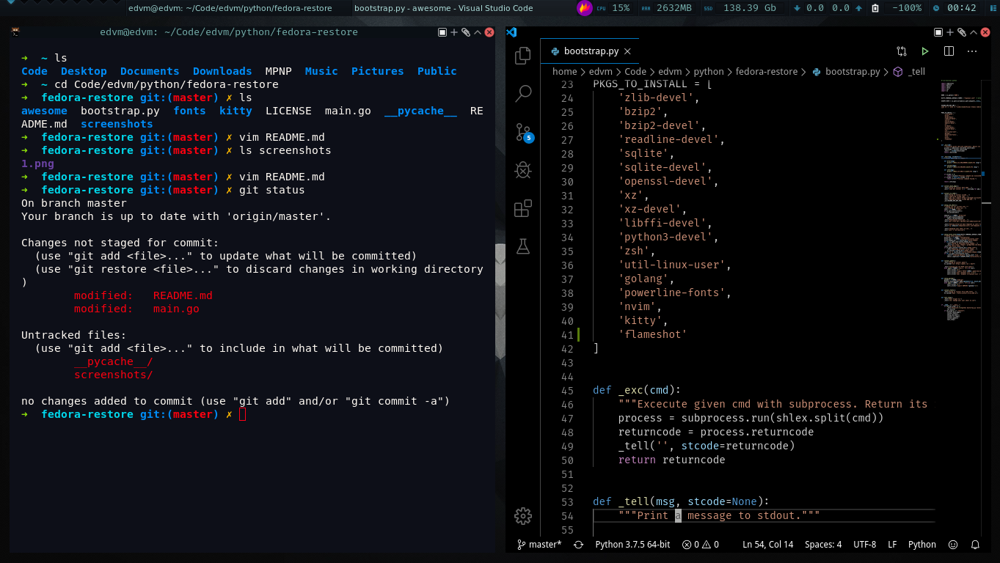

# Fedora Restore

It's a personal and simple (quickly written) script to install
all the usual tools I use on my fedora workstation.

Ideal to be excecuted after a fresh Fedora install. You will end
with a Fedora workstation plus:

- vscode
- zsh and oh-my-zsh configured for the user that runs the script
- golang (with GOPATH configured for current user)
- pyenv (https://github.com/pyenv/pyenv)
- Fira Code fonts (https://github.com/tonsky/FiraCode/)
- Kitty terminal (https://sw.kovidgoyal.net/kitty/) and autoconfigure it with my prefs
- Kitty themes (https://github.com/dexpota/kitty-themes)
- awesome wm + default config
- flameshot (https://flameshot.js.org/#/) to take screenshots 

## Screenshots

PR's are welcome!
