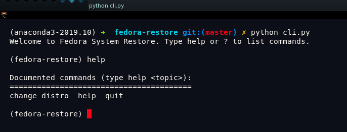
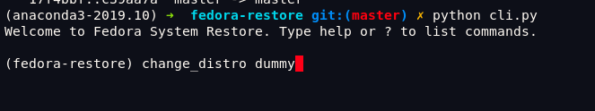
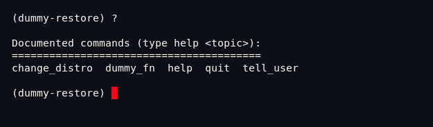

# System Restore

It's a personal and simple (quickly written) script to install
all the usual tools I use on my workstation.

Ideal to be excecuted after a fresh system install. You will end
with:

- vscode
- zsh and oh-my-zsh configured for the user that runs the script
- golang (with GOPATH configured for current user)
- pyenv (https://github.com/pyenv/pyenv)
- Fira Code fonts (https://github.com/tonsky/FiraCode/)
- Kitty terminal (https://sw.kovidgoyal.net/kitty/) and autoconfigure it with my prefs
- Kitty themes (https://github.com/dexpota/kitty-themes)
- awesome wm + default config
- flameshot (https://flameshot.js.org/#/) to take screenshots 
- fisavim (http://vim.fisadev.com/)

## How to use it:

Just execute `python cli.py`. Use `change_distro fedora` and then type `help` to get the list of commands.

## It's extensible

Take a look at `dummy.py`. Inside the shell (see above) you can type `change_distro dummy` and all functions
defined in `dummy.py` will be available (check it typing `help` or `?`). 

So then, all the `dummy.py` functions are available:

To extend it to Ubuntu, just create
a new file `ubuntu.py` with your functions. Take a look at `fedora.py`, some functions are distro independent.

# Some screenshots of what you get

## Window manager screenshots (awesome wm) 

PR's are welcome!
